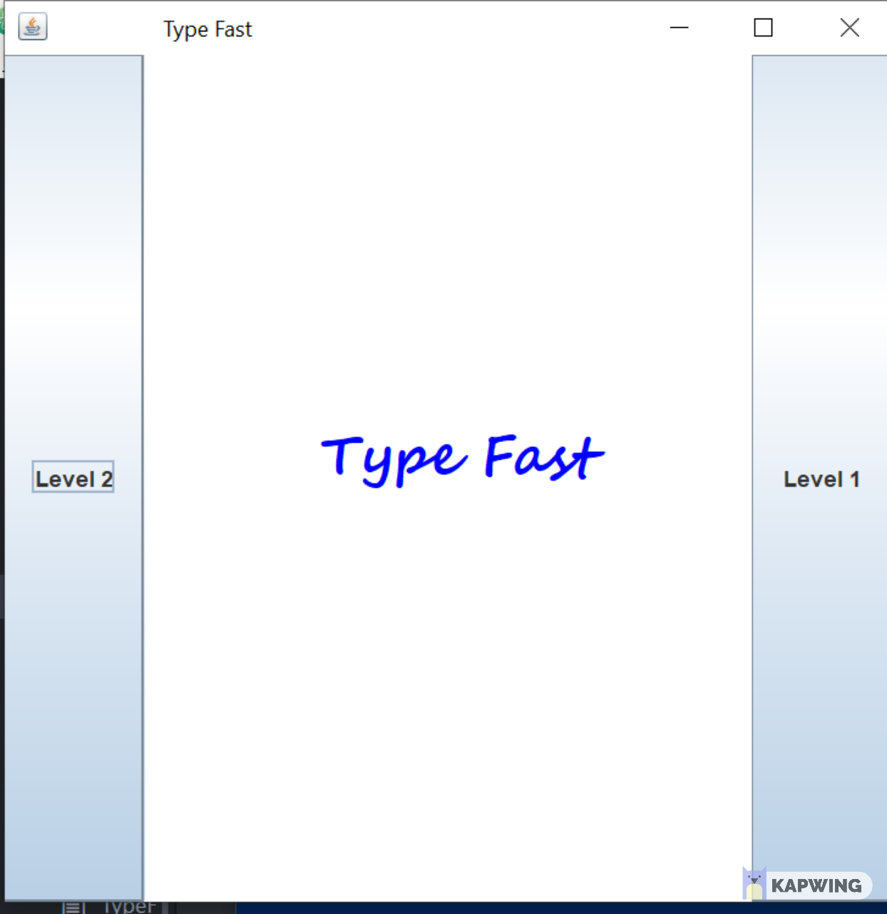
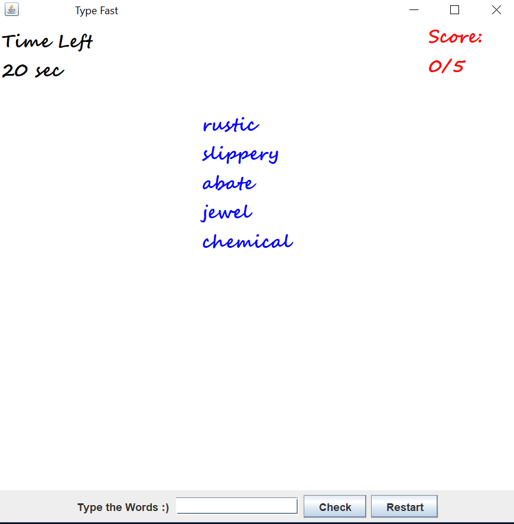

# Type Fast Game
## Overview
This program is a fun and simple typing game. Equipped with two levels of game play, users have a limited amount of time to type in a set of words before the give 20 seconds runs out.

### Level 1
Level 1 is easy. You have 20 seconds to type in the five words in the text box. You can press enter or click the 'check' button when finished typing. If your answer is write, your score increases by one. The tricky thing about this Level is you have to remember the words you already entered because you won't get an additional score for that.

### Level 2

Level 2 is hard. You have 20 seconds to type in the words that are shuffled and popped throughout the screen. You can press enter or click the 'check' button when finished typing. If your answer is write, your score increases by one. The tricky thing about this Level is you have to get the spellings of the words before the screen gets clogged. A helpful Tip for this level is the words apear less frequently, if you answer them. So look for the latest popped word instead of trying to remember which words you entered.

## Built with:
JDK tools: Used to debug and compile the Java code.

Atom and Notepad++: Used to write and edit the source code of the game and README

## Prerequisites:

JDK(Java Development Kit): Used to compile the Java source file into Java Bytecode .

JRE(Java Runtime Environment): This is necessary to run the java bytecode in the JVM(Java Virtual Machine)

Command console: This is used to run the necessary commands to execute the code

## Usage:

Javac *.java     -           To compile the java code

Java StartGame    -    This used to start the Game by the ruunign the code

## Getting Started:

As you run the game by executing the above commands, a main window
will apear. The main has two sets of button named Level 1 and Level 2 at the opposite ends of the frame as shown below. You can choose one of the two levels provided by the Game by clicking one of the two buttons.




-------------------------------------------------------------------------------------------------------------------------------

## Instruction:


1. Click the right button, if you want to play Level l

2. Click the left button, if you want to play Level 2

## Example:


After Clicking Level One:

The display is as below the lower section. Enter the correct spelling of the word in the textbox and click the 'check' button to
increase your score.



-------------------------------------------------------------------------------------------------------------------------------------------------  

## Contact:

Gebreegziabhery@carleton.edu


# Correct and efficient use of inheritance with at least one superclass and two subclasses

The Game has two levels. Since a level of a game is different version of the same game, it would make sense to use inheritance by making 'the game' a super class and making the individual 'levels' subclasses. So in this game 'TypeFast.class' is the superclass which contains essential methods of the game like checkIfCorrect(), countDownTimer(), incrementScore(), restart() ,and others. These methods are shared and used by the two individuals 'levels'.

 The two subclasses Level1.class and Level2.class override methods like initiate(), checkWin(), lost() because the two individuals levels need a different implementation of these methods because of the different game play of these two 'levels'.

 A line by line proof of inheritance is displayed below:

 ## Example of inheritance for Level1
 ```java
 public class Level1 extends TypeFast{   

 ```
 ## Example of inheritance for Level2

 ```java
 public class Level2 extends TypeFast{

 ```
 ## Examples of methods in TypeFast.java(The super class) that are used by both levels(the sub classes)
 ```java

 public  ArrayList<Word> loadWordList(){
    String[] wordData = parseWordList("WordList.txt").split(",");
   ArrayList<Word> wordList = new ArrayList<>();

   for(int i = 0;i<wordData.length;i++){
     if(wordData[i].matches("[a-zA-Z]+")){
       Word newWord = new Word(wordData[i]);
       wordList.add(newWord);
     }
   }

   return wordList;

 }
 public HashMap<String,Word> mapWordListAsHash(){
   wordList = new HashMap<String, Word>();
   ArrayList<Word> wordListA = loadWordList();
   for(int i = 0;i<wordListA.size();i++){
     wordList.put(wordListA.get(i).getWord(),wordListA.get(i));
   }
   return wordList;
 }
 public boolean checkIfCorrect(String text, HashMap<String, Word> hash){
   if(hash.get(text)!=null && hash.get(text).getWord() != "" && !hash.get(text).getIsAnswered()){
     hash.get(text).setIsAnswered(true);
     incrementScore();
     return true;
   }
   else{
     return false;
   }
 }
 public void restart() {
   score = 0;
   updateScore();
   flag = true;
   timer.stop();
   timer2.stop();
   initiate();
   setUp();
 }
 public void retry(){
   check.setEnabled(true);
   enterKeyFlag = true;
   flag = true;
   reset.setText("Restart");
   initiate();
   timer.restart();
   timer2.restart();
   setUp();
 }
 public void inActivate(){
   score = 0;
   timer.stop();
   timer2.stop();
   main.remove(panel2);
   enterKeyFlag = false;
   reset.addActionListener(new ActionListener(){
     public void actionPerformed(ActionEvent e){
       retry();
     }
    });
    reset.setText("Retry");
    check.setEnabled(false);
 }

```
## Examples of Methods that is overridden by both sub classes
### In TypeFast.java(The superclass)
```java
public void initiate(){
}
public void lost(){
}

```
### In Level1.java(The subclass)
```java
public void initiate(){

  main.getContentPane().removeAll();
  main.repaint();

  word1 = new JTextArea();
  word1.setText("");
  words = loadWordList();
  random = new Random();
  word1.append("\n\n");
  for(int i = 0;i<5;i++){
   word1.append("\n" + "\s".repeat(15) + words.get(random.nextInt(words.size())).getWord());
  }
  f = new Font("Segoe Script", Font.BOLD, 20);
  word1.setFont(f);
  word1.setForeground(Color.BLUE);
  word1.setEditable(false);

  scoreBoard = new JTextArea();
  main.getContentPane().add(scoreBoard);
  main.getContentPane().add(BorderLayout.EAST, scoreBoard);

  main.getContentPane().add(word1);
  main.getContentPane().add(BorderLayout.CENTER, word1);

  main.setVisible(true);

  startTimer();


}
public void lost(){
  main.getContentPane().add(BorderLayout.EAST, scoreBoard);
  scoreBoard.setText("");
  word1.setText("You Lost");
  inActivate();
}

```
### In Level2.java(The subclass)
```java
public void initiate(){

  main.getContentPane().removeAll();
  main.repaint();

  word1 = new Word();
  word2 = new Word();
  word3 = new Word();
  word4 = new Word();
  word5 = new Word();
  Word[] wordVar = {word1,word2,word3,word4,word5};

  words = loadWordList();
  wordQueue = new PriorityQueue<>();

  random = new Random();

  for(int i = 0;i<5;i++){
    wordVar[i].setWord(words.get(random.nextInt(words.size())).getWord());
    wordQueue.add(wordVar[i]);
  }

  scoreBoard = new JTextArea();
  main.getContentPane().add(scoreBoard);
  main.getContentPane().add(BorderLayout.EAST, scoreBoard);

  panel = new JPanel(new BorderLayout());
  main.add(panel);


  main.setVisible(true);

  startWordMovement();

  startTimer();

}

```
## Example of Methods that are only found in one of the subclasses
### In level2.java(one of the subclasses) only
```java
public Word customRepaint(Graphics g){

    super.paintComponent(g);
    Word word = wordQueue.poll();
    Graphics2D draw=(Graphics2D)g;
    draw.setColor(Color.BLUE);
    draw.setFont(f);
    draw.drawString(word.getWord(),word.getX(),word.getY());
    try{
        Thread.currentThread().sleep(random.nextInt(1500));
    }
    catch(Exception e){}
    return word;

}
```
# Correct and efficient use of two other class concept

The program uses a HashMap and a PriorityQueue to facilitate the gameplay.

 HashMaps are used to search and identify the words the player has entered in order to verify the spelling. They allow the program to exatcly locate the Word object based on it's string content. HashMaps are effective in this case because they have an O(1) complexity when searching for an object which decreases game lag.

Priority Queues are used in Level 2 of the game. They are helpful in this case because the game needs to prioritize unanswered words when displaying them dynamically in the screen. So if a word is correctly typed, it's popped from the priority queue and added back, this time with a decreased priority. So it appears less often during the display.

## Example of HashMaps Usage
```java
public HashMap<String,Word> mapWordListAsHash(){
  wordList = new HashMap<String, Word>();
  ArrayList<Word> wordListA = loadWordList();
  for(int i = 0;i<wordListA.size();i++){
    wordList.put(wordListA.get(i).getWord(),wordListA.get(i));
  }
  return wordList;
}
public boolean checkIfCorrect(String text, HashMap<String, Word> hash){
  if(hash.get(text)!=null && hash.get(text).getWord() != "" && !hash.get(text).getIsAnswered()){
    hash.get(text).setIsAnswered(true);
    incrementScore();
    return true;
  }
  else{
    return false;
  }
}
```

## Example of PriorityQueue Usage

```java
PriorityQueue<Word> wordQueue;
.
.
.
wordQueue = new PriorityQueue<>();
for(int i = 0;i<5;i++){
  wordVar[i].setWord(words.get(i));
  wordQueue.add(wordVar[i]);
}
.
.
.
if(hashingList.get(tempWord.getWord()).getIsAnswered()){
 tempWord.setPriority(tempWord.getPriority()-99);
}
else{
 tempWord.setPriority(tempWord.getPriority()-1);
}
wordQueue.add(tempWord);
.
.
.
Word word = wordQueue.poll();
.
draw.drawString(word.getWord(),word.getX(),word.getY());

```

# Sufficiently substantive project

This game has five classes with a combined code of approximately 500 line.

# Clear and complete Readme

Readme is very detailed and clear as you can see


## JavaDocs documentation filled in:

Sufficient Documentation have been provided for each of the methods.


## Otherwise good style:

Indentations and Methods are used where necessary.
